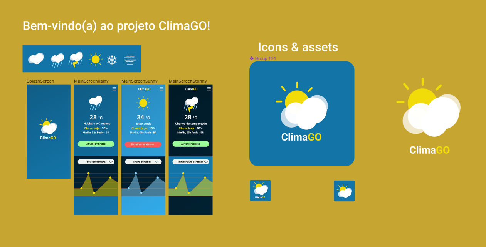

# Clima Go
Um aplicativo para monitorar a previsão do tempo e temperatura integrado com a API do OpenWeather

## Como Executar o App

Para iniciar o aplicativo, utilize o seguinte comando:

```bash
yarn start
```

Se desejar executá-lo em um dispositivo móvel, é necessário ter o Expo instalado. Veja como fazer isso para Android ou iOS:
## Android

    Instale o Expo Go na Play Store.
    Escaneie o código QR gerado ao iniciar o aplicativo com o Expo Go.

## iOS

    Instale o Expo Go na App Store.
    Escaneie o código QR gerado ao iniciar o aplicativo com o Expo Go.

## Se preferir utilizar um emulador:
Emulador

    Certifique-se de ter um emulador configurado no seu ambiente de desenvolvimento.
    Execute o comando yarn start no terminal.
    No terminal, escolha a opção para executar o app no emulador desejado.

## Stack

    React Native
    Typescript
    Expo
    Open WeatherAPI

## Recursos

    Alertas de mudanças climáticas
    Funcionalidades que mudam o tema do aplicativo conforme a hora do dia, clima e temperatura atual.